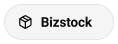
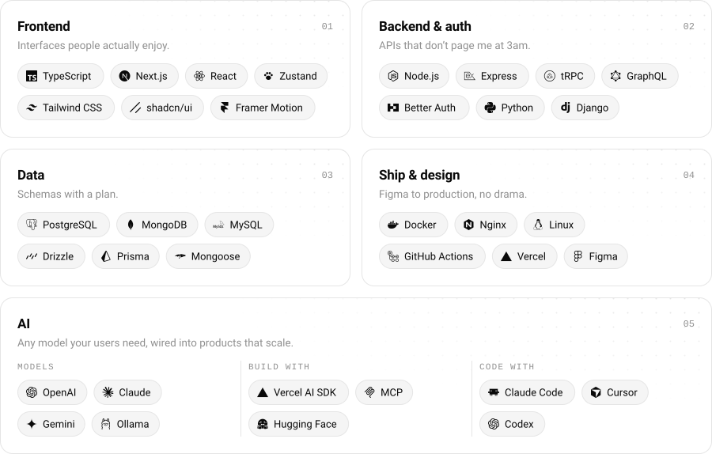
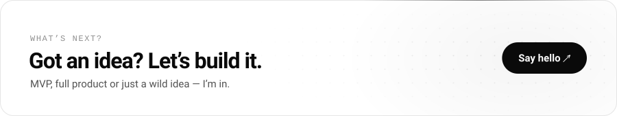

<a href="https://salman.dragondevs.co">
  <picture>
    <source media="(prefers-color-scheme: dark)" srcset="./assets/hero-dark.svg">
    <source media="(prefers-color-scheme: light)" srcset="./assets/hero-light.svg">
    
  </picture>
</a>

  <a href="https://x.com/skdrh_"><picture><source media="(prefers-color-scheme: dark)" srcset="./assets/links/x-dark.svg"></picture></a>
  <a href="https://www.linkedin.com/in/skdrh/"><picture><source media="(prefers-color-scheme: dark)" srcset="./assets/links/linkedin-dark.svg"></picture></a>
  <a href="https://salman.dragondevs.co"><picture><source media="(prefers-color-scheme: dark)" srcset="./assets/links/portfolio-dark.svg"></picture></a>
  <a href="https://dragondevs.co"><picture><source media="(prefers-color-scheme: dark)" srcset="./assets/links/dragondevs-dark.svg"></picture></a>
  <a href="https://bizstock.net"><picture><source media="(prefers-color-scheme: dark)" srcset="./assets/links/bizstock-dark.svg"></picture></a>

### Hey, I'm Salman 👋

I build products end to end: the idea, the scalable architecture, the UI, the API, the database, the AI, even the deploy script. Bring me a real problem and I'll hand you back a real product, fast.

8+ years and 30+ projects in, I'm now building **[dragondevs.co](https://dragondevs.co)**, a company that makes useful digital products and takes them global. 🐉

### ⚡ Right now

- 📦 **[Bizstock](https://bizstock.net)**: offline-first inventory & POS for small businesses. It keeps selling when the Wi-Fi quits, then syncs when it's back.
- 🚀 **[dargo-cli](https://github.com/dragon-devs/dargo-cli)**: deploys Next.js to your own Debian VPS with auto SSL, env management and zero-downtime releases. DevOps, minus the tears.
- 🏗️ **Multi-tenant SaaS** on Next.js, because one tenant is never enough.

### 🛠️ Things I've built

| Project | The short version |
|:--|:--|
| 🗂️&nbsp;**[Project&nbsp;Manager](https://github.com/skdrh/project-manager)** | Open-source project, task & resource management for software houses. |
| 🐛&nbsp;**[Issue&nbsp;Tracker](https://github.com/skdrh/issue-tracker)** | Bugs go in, fixes come out. Next.js + Prisma, with auth. |
| 💬&nbsp;**[ChatApp](https://github.com/skdrh/chatapp)** | Django chat, built from scratch: random rooms, who's online, private DMs. |
| 🧪&nbsp;**MedLab&nbsp;Manager** | Inventory, sales & invoices for companies selling lab tools and medicine. |
| 🖼️&nbsp;**Gallery&nbsp;Next** | Image uploads with permissions and Google/GitHub sign-in. |
| 🎓&nbsp;**School&nbsp;LMS** | School & college learning platform, built with OBS. I did the UI and core features. |

…plus 20+ more on <a href="https://salman.dragondevs.co">salman.dragondevs.co</a> →

### 🧰 Toolbox

<picture>
  <source media="(prefers-color-scheme: dark)" srcset="./assets/stack-dark.svg">
  <source media="(prefers-color-scheme: light)" srcset="./assets/stack-light.svg">
  
</picture>

### 🧭 How I work

1. **Solve real problems.** If nobody needs it, it doesn't get built.
2. **Validate fast.** Ship the MVP, learn, iterate, repeat.
3. **Build to scale.** Today's MVP is tomorrow's production system, so I build it like one.

<b>📊 Nerd stats</b> (click to expand)

 
<picture>
  <source media="(prefers-color-scheme: dark)" srcset="https://streak-stats.demolab.com?user=skdrh&border_radius=16&background=0A0A0A&border=262626&stroke=262626&ring=EDEDED&fire=22C55E&currStreakNum=EDEDED&sideNums=EDEDED&currStreakLabel=EDEDED&sideLabels=A1A1A1&dates=737373">
  
</picture>
<picture>
  <source media="(prefers-color-scheme: dark)" srcset="https://github-readme-activity-graph.vercel.app/graph?username=skdrh&bg_color=0A0A0A&color=A1A1A1&title_color=EDEDED&line=EDEDED&point=22C55E&area=true&area_color=EDEDED&hide_border=true&radius=16">
  
</picture>

 

<a href="https://salman.dragondevs.co">
  <picture>
    <source media="(prefers-color-scheme: dark)" srcset="./assets/cta-dark.svg">
    <source media="(prefers-color-scheme: light)" srcset="./assets/cta-light.svg">
    
  </picture>
</a>
